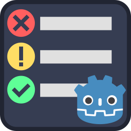
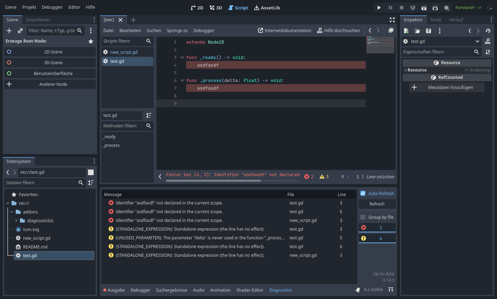

# Godot Diagnostic List

This editor plugin provides project-wide diagnostics for GDScript files. 
It tracks every GDScript file in the project and gathers all errors and warnings in a global list. 
Useful in larger projects, during refactoring or porting a project from Godot 3.x to 4.x.

 

 

If you like this plugin and want to support my work, consider leaving a tip on Ko-fi. 

## Installation

1. Download the plugin
    - From this repository
    - From the [Asset Library](https://godotengine.org/asset-library/asset/2482)
    - From the [Beta Asset Store](https://store-beta.godotengine.org/asset/mphe/diagnostic-list/)
2. Copy the `addons/` directory to your project
3. Enable the plugin in the project settings
4. (Possibly) Restart Godot

## Usage

**NOTE**: It is not possible to run multiple Godot instances with this addon. See also [Known Issues](#known-issues).

The diagnostic panel appears in the bottom dock.

Double-clicking an entry opens the editor and jumps to the respective location in the script.

On the right side of the diagnostic panel are various controls:

- **Auto-Refresh**: Automatically refresh diagnostics when files have been modified. The plugin will only update diagnostics when the panel is visible. 
  **NOTE:** In large projects, a diagnostic update can take up to several seconds. Hence, it might be desirable to deactivate this option in larger projects or keep the panel hidden until needed.
- **Refresh**: Manually trigger a refresh.
- **Group by file**: Change the sorting method to group diagnostics by their source file.
- **Diagnostic Filters**: Shows the amount of errors and warnings in the project.
  Toggling these buttons will show or hide those diagnostics from the list.

## Ignoring Directories

Directories with a `.gdignore` or `.diagnostic_ignore` file are ignored.
The latter is useful for ignoring certain directories without interfering with Godot behavior.

If the `debug/gdscript/warnings/exclude_addons` project setting is enabled, it will also ignore files in `addons/`.

## Known Issues

### Does not work correctly with multiple Godot instances

  This addon relies on the language server protocol to retrieve diagnostics from Godot.
  Godot starts a language server on the port defined in the editor settings under `network/language_server/remote_port`.
  If the port is already in use, e.g. by the LS of another Godot instance, Godot is unable to start a new LS.
  Hence, this plugin is unable to connect to the correct Godot instance and report correct diagnostics in such cases.

### Godot freezes in larger projects on Windows 11

In larger projects, refreshing diagnostics or opening the diagnostic panel (which may trigger a refresh) can cause Godot to freeze on Windows 11. 
This seems to be a bug in Windows 11's [TCP window scaling](https://en.wikipedia.org/wiki/TCP_window_scale_option) implementation.

The workaround is to enable `Use Thread` under `Editor settings -> Network -> Language server`.

See also [#2](https://github.com/mphe/godot-diagnostic-list/issues/2).

## Showcase

https://github.com/mphe/godot-diagnostic-list/assets/7116001/4c8c9784-94cc-4079-b929-8e2a076424e5
